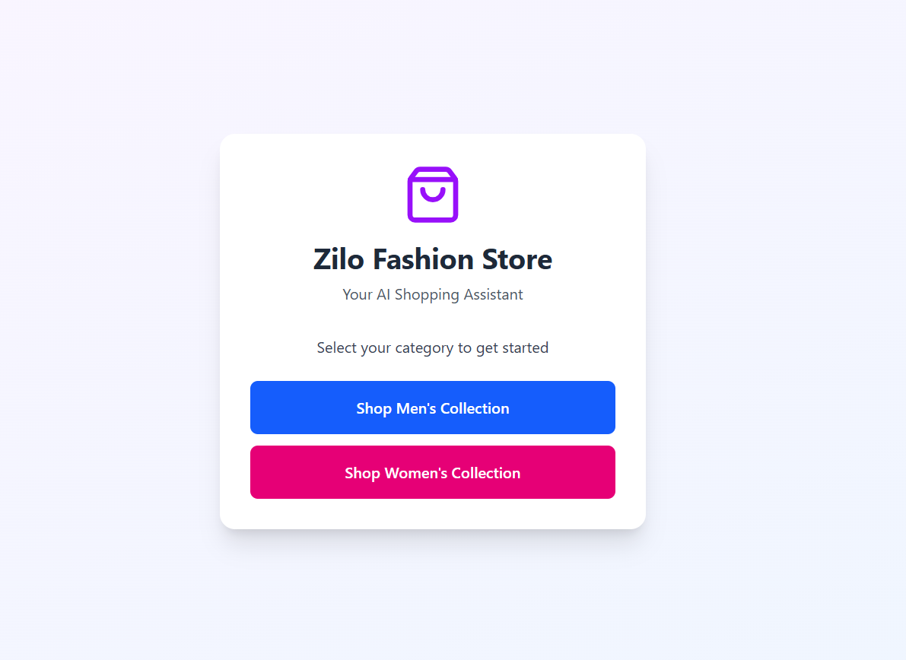
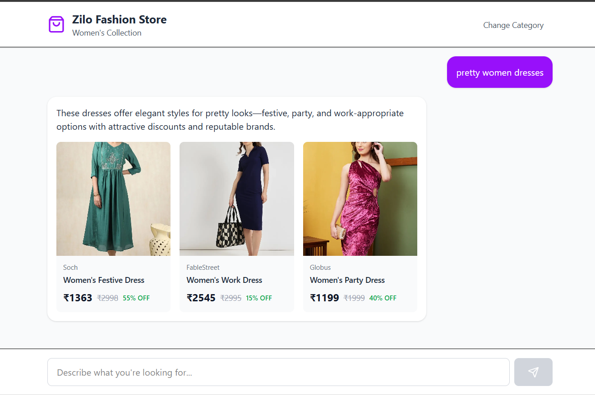

# Zilo Fashion Store - AI Shopping Assistant




An AI-powered chatbot that helps customers find the perfect outfit based on their needs and occasions.

## Features

- Gender-specific product recommendations (Men's & Women's collections)
- Natural language understanding for customer queries
- Smart product suggestions based on occasion, style, and price
- Clean, responsive chat interface
- Direct links to product pages
- scrape using a curl command for it 
```curl
curl -s 'https://zilo.one/c/hot-deals-women?collection_name=Hot%20Deals%20-%20Women' \
  -H 'x-zilo-pincode: 400069' \
  -H 'x-zilo-city: Mumbai' > page.html
```
-using google ai studio i made like a json for page 1 of hot deals of both men and women 

## Tech Stack

**Backend:**
- FastAPI - Web framework
- SQLite (in-memory) - Product database
- Nebius AI (Nemotron 3) - LLM for recommendations
- Pydantic - Data validation

**Frontend:**
- React - UI framework
- Tailwind CSS - Styling
- Lucide React - Icons

## Project Structure

```
backend/
├── main.py          # FastAPI app and endpoints
├── models.py        # Pydantic models
├── database.py      # In-memory SQLite setup
├── llm.py           # AI integration
├── men.json         # Men's product data
└── women.json       # Women's product data

frontend/
└── src/
    └── App.jsx      # React chat interface
```

## Setup & Installation

### Backend

1. Install dependencies:
```bash
pip install fastapi uvicorn openai pydantic
```

2. Set environment variable:
```bash
.env
 NEBIUS_API_KEY=your_api_key_here
```

3. Run the server:
```bash
uvicorn main:app --reload
```

Backend runs on `http://localhost:8000`

### Frontend

1. Create React app and install dependencies:
```
npm create vite@latest
react-Javscript
npm install tailwindcss @tailwindcss/vite
```

2. Configure Tailwind (see docs)

3. Replace `src/App.jsx` with the provided component

4. Run the app:
```bash
npm run dev
```

Frontend runs on `http://localhost:3000`

## Usage

1. Select gender category (Men/Women)
2. Type your requirement (e.g., "formal shirt for office", "wedding outfit under 2000")
3. Get AI-powered product suggestions
4. Click on product cards to view full details

## API Endpoints

### POST /chat
Request:
```json
{
  "gender": "men",
  "message": "looking for formal shirts"
}
```

Response:
```json
{
  "message": "Here are some great formal options...",
  "products": [
    {
      "id": "...",
      "brand": "...",
      "name": "...",
      "price": 799,
      "image_url": "...",
      "product_url": "..."
    }
  ]
}
```

### GET /health
Check if database is loaded and API is running.

## How It Works

1. User selects gender and sends a message
2. Backend fetches relevant products from in-memory database
3. All products sent to AI model with user's query
4. AI analyzes and selects 2-3 best matches
5. Backend returns recommendations with explanation
6. Frontend displays product cards
7. this is just for testing purposes that i made for making this thing works.

## Future Enhancements

- Conversation history/memory
- Price range filtering
- Category-based search
- User preferences
- Vector embeddings for larger catalogs
- PostgreSQL for production
- Location based filtering 

## License

MIT

## Author

Built for Zilo Fashion Store, Mumbai
